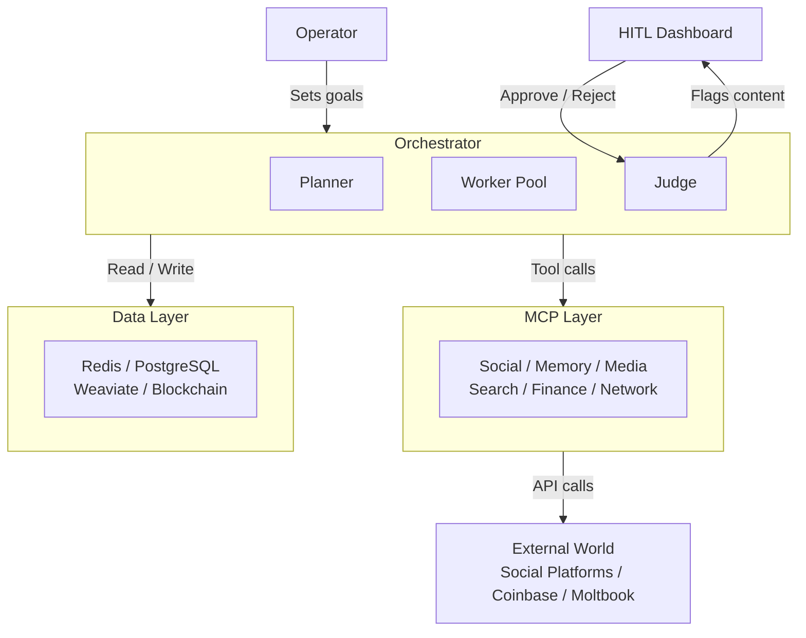

# Project Chimera — Autonomous Influencer Network

> A platform for building and operating autonomous AI influencer agents at scale — each with a persistent persona, long-term memory, and the economic agency to act independently.

[](https://github.com/your-org/project-chimera/actions/workflows/main.yml)
[](https://openjdk.org/projects/jdk/21/)
[](https://spring.io/projects/spring-boot)
[](https://maven.apache.org/)
[](#)

---

## Overview

Project Chimera is a platform for building and operating **1,000+ concurrent autonomous AI influencer agents** across multiple social platforms. Each agent maintains a persistent persona, three-tier memory, and the ability to perceive trends, generate multimodal content, and interact with audiences entirely without human intervention on routine tasks.

The core problem it solves is the **economics of influence at scale**: a human creator manages one account, a small team manages five — Chimera manages a thousand simultaneously without a proportional increase in human headcount.

The approach is a **FastRender Swarm** (named in the SRS): a Planner-Worker-Judge architecture where stateless Workers execute tasks in parallel via Java Virtual Threads, all external calls route exclusively through MCP servers, and every financial transaction is gated by a dedicated CFO Sub-Judge. The result is genuine agent autonomy with a human meaningfully in control of what matters.

---

## Architecture

### Planner — Worker — Judge

Every unit of agent work flows through exactly three roles connected by Redis message queues:

- **Planner** — reads `GlobalState`, decomposes campaign goals into a directed acyclic graph (DAG) of `AgentTask` records, pushes them to Redis. Never executes actions directly.
- **Worker** — stateless and ephemeral. Pops exactly one task via a Java Virtual Thread, executes it through the MCP Tool layer, and pushes an `AgentResult` to the review queue. Workers share no mutable state.
- **Judge** — evaluates every result against persona constraints, confidence thresholds, and safety rules. Approves (via OCC commit), escalates to the HITL dashboard, or signals the Planner to re-queue.



### Confidence Score Routing

The Judge routes every Worker result through two sequential phases:

| Condition | Route | Blocks Agent? | Human Reviews? |
|---|---|---|---|
| Sensitive topic flag (Politics/Health/Finance/Legal) | Mandatory HITL | No | Always |
| Financial task type (`TRANSFER_FUNDS`, `DEPLOY_TOKEN`) | CFO Sub-Judge → budget check | Yes (for check) | Only if limit exceeded |
| `score > 0.90`, no flags | AUTO-APPROVE + OCC commit | No | No |
| `0.70 ≤ score ≤ 0.90`, no flags | Async HITL queue | No | Yes, async |
| `score < 0.70` | AUTO-REJECT + Planner retry | No | No |
| `retry_count ≥ max_retries` | FAILED + Operator alert | No | Yes, async |

### Memory Architecture

Agents maintain three memory layers assembled into a single context window before every LLM call:

| Layer | Store | TTL | Purpose |
|---|---|---|---|
| Short-term episodic | Redis `chimera:cache:{agentId}` | 1 hour | Recent actions, last post, active trend |
| Long-term semantic | Weaviate (self-hosted) | Permanent | Past interactions, content archive, duplicate detection |
| Persona | `SOUL.md` (immutable file) | Process lifetime | Identity, voice, hard directives |


## Tech Stack

| Technology | Purpose | Min Version |
|---|---|---|
| **Java** (OpenJDK) | Primary language; Virtual Threads (Project Loom), Records, pattern matching | 21 LTS |
| **Spring Boot** | Application framework; DI, web layer, actuator | 3.3 |
| **Spring Data JPA** | ORM for PostgreSQL; `@Version` enforces OCC on `global_state` | 3.3 |
| **Maven** | Build tooling; Checkstyle, JaCoCo, Surefire | 3.9 |
| **Redis** (Cluster mode) | Task queue, review queue, episodic cache, atomic spend counter | 7+ |
| **Jedis** | Redis client; `LPUSH`, `RPOP`, `BRPOP`, `INCRBY`, Lua scripting | 5.x |
| **PostgreSQL** | System of record; campaigns, agents, OCC global state, audit log | 16+ |
| **Weaviate** (self-hosted) | Vector semantic memory; hybrid search alpha=0.75 | 1.24+ |
| **Jackson Databind** | JSON serialisation for all inter-service payloads (snake_case wire format) | 2.17 |
| **JUnit 5 (Jupiter)** | Test framework; TDD — failing test before any implementation | 5.11 |
| **Mockito** | Mock MCP servers and external dependencies in unit tests | 5.x |
| **Testcontainers** | Ephemeral PostgreSQL, Redis, Weaviate for integration tests | 1.20 |
| **AssertJ** | Fluent assertions; preferred over `assertEquals` | 3.26 |
| **Checkstyle** | Enforces MCP boundary rules, Records-for-DTOs, no JUnit 4 | 10.x |
| **JaCoCo** | Coverage gate: 80% line, 75% branch | 0.8+ |
| **Docker** | Container packaging; every deployable service ships as image | 25 |
| **Blockchain (Base L2)** | Immutable financial ledger; ERC-20 fan token contracts | — |

---

## Getting Started

### Prerequisites

| Requirement | Version | Check |
|---|---|---|
| Java (OpenJDK) | 21 LTS | `java -version` |
| Maven | 3.9+ | `mvn -version` |
| Docker | 25+ | `docker --version` |
| Redis | 7+ | `redis-server --version` |

### Installation

```bash
# 1. Clone the repository
git clone https://github.com/your-org/project-chimera.git
cd project-chimera

# 2. Compile and install dependencies (skips tests)
make setup

# 3. Run the full JUnit 5 test suite
make test

# 4. Run Checkstyle (enforce architecture rules)
make lint

# 5. Verify all spec documents are present
make spec-check
```

All targets and their descriptions:

```
make setup        Install dependencies and compile (skips tests)
make test         Run the full JUnit 5 test suite
make lint         Run Checkstyle — enforces Constitution Principle I style rules
make spec-check   Verify all spec documents are present
make docker-test  Build Docker image and run tests inside the container
```

---

## Spec-Driven Development

Project Chimera follows **Spec-Driven Development (SDD)** — a non-negotiable workflow where every line of implementation code must trace back to an approved specification. The sequence is strictly:

> **Spec → Plan → Tasks → Implementation**

No source file is created or modified without a corresponding `spec.md` in the `specs/` directory. This rule is enforced by `CLAUDE.md`, Checkstyle rules, and CodeRabbit review policy. A commit that introduces implementation code without a preceding spec is a constitution violation that blocks merge.

### The Prime Directive

```
NEVER generate implementation code without first reading the relevant spec file.
```

### Spec Files

| File | What It Governs |
|---|---|
| `specs/_meta.md` | Project vision, strategic goals, constraints, system boundaries, 7 non-negotiable rules |
| `specs/functional.md` | 21 user stories (US-1.1–US-6.5) with 3 acceptance criteria each, across 6 modules |
| `specs/technical.md` | JSON API contracts, Java Records definitions, PostgreSQL/Redis/Weaviate schemas, confidence routing pseudocode, full tech stack |
| `specs/openclaw_integration.md` | Moltbook integration paths, AgentStatus payload schema, 4-stage injection defence, 3-tier trust model |
| `.specify/memory/constitution.md` | Seven engineering principles — two are NON-NEGOTIABLE: Spec-Driven (II) and TDD (VI) |
| `.specify/memory/task_breakdown.md` | 48 tasks organized by module with priorities (HIGH/MEDIUM/LOW) and dependency chains |
| `.specify/memory/implementation_tasks.md` | 68 numbered TDD-ordered implementation tasks in speckit checklist format |

---

## Agent Skills

Skills are OpenClaw-compatible modular capability packages. Each skill is independently testable, MCP-routable, and follows a strict Input/Output contract. Skills map directly to MCP Tools at the architecture level.

### `skill_download_youtube`

Downloads a YouTube video to a local directory using `yt-dlp` and `ffmpeg`. Validates the URL before any network activity, enforces a configurable maximum duration ceiling, and charges the estimated compute cost against the agent's daily budget via the CFO Sub-Judge.

- **Input**: `video_url`, `output_dir`, `max_duration_seconds`
- **Output**: `file_path`, `duration_seconds`, `file_size_bytes`
- **Errors**: `IllegalArgumentException` (invalid URL), `DurationExceededException`, `DownloadFailedException`, `BudgetExceededException`

### `skill_transcribe_audio`

Transcribes an audio file using the OpenAI Whisper API or a locally-hosted Whisper model. Validates the file extension before submission and charges the estimated transcription cost (by duration) against the daily budget.

- **Input**: `audio_file_path`, `language` (ISO 639-1, optional), `model`
- **Output**: `transcript`, `confidence` (float 0–1), `duration_seconds`
- **Errors**: `IllegalArgumentException` (non-audio file), `FileNotFoundException`, `UnsupportedLanguageException`, `TranscriptionFailedException`, `BudgetExceededException`

Both skills follow identical README structures — see `skills/*/README.md` for full contracts, example JSON, and dependency install instructions.

---

## Testing Strategy

Project Chimera uses **Test-Driven Development (TDD)** as a non-negotiable practice (Constitution Principle VI). The sequence per task is:

> **Write failing test → confirm failure → implement → confirm pass → refactor**

The two test files currently in `src/test/java/org/chimera/` are **intentionally failing at compile time** — they define the implementation target before the implementation exists. This is by design.

```bash
# Run the full test suite
make test

# Test reports
target/surefire-reports/    # Individual test results
target/site/jacoco/         # Coverage report (80% line / 75% branch gate)
```

### What the Tests Cover

| Test File | Tests | What Is Verified |
|---|---|---|
| `TrendFetcherTest.java` | 11 | `TrendAlert` record fields, immutability, compact constructor validation (score ≥ 0.75, expiresAt > detectedAt), `fetchTrends()` non-empty result, threshold filter, no duplicate trendIds, 4-hour window |
| `SkillsInterfaceTest.java` | 14 | `DownloadYoutubeSkill` valid URL contract, video extension, MIME type; 8 invalid URL cases (`@ParameterizedTest`); `TranscribeAudioSkill` transcript/language/confidence; `BudgetExceededException` structured fields; happy path no-budget-throw |

All tests use JUnit 5 (`@Test`, `@ParameterizedTest`, `@DisplayName`), AssertJ assertions, and Java 21 Records for inline DTOs. No JUnit 4 is permitted — Checkstyle will fail the build.

---

##  CI/CD & Governance
### GitHub Actions

Every push and pull request to `main` triggers the CI pipeline (`.github/workflows/main.yml`):

1. **Spec check** — verifies all 4 required spec files exist before spending compile time
2. **Build** — `make setup` (Maven compile + install, tests skipped)
3. **Test** — `make test` (full JUnit 5 suite; surefire + JaCoCo reports uploaded as artifacts)
4. **Lint** — `make lint` (Checkstyle; fails build on any violation)
5. **PR comment** — on failure, posts a structured markdown table to the PR identifying which step failed and linking to the fix

### CodeRabbit AI Review

Every PR is reviewed by CodeRabbit (`.coderabbit.yaml`) with five automated policies:

| Policy | Principle | What It Catches |
|---|---|---|
| **Spec Alignment** | Constitution II | Code without a backing spec, uncovered acceptance criteria |
| **Java Thread Safety** | Constitution V | `newFixedThreadPool()` for I/O, missing `StructuredTaskScope`, shared mutable state |
| **Security Vulnerabilities** | `_meta.md` §6 Rules 1, 5 | `String` private keys, hardcoded secrets, command injection, missing sanitization flag |
| **Immutability** | Constitution I | Plain class DTOs instead of Records, mutable collection fields, missing `requireNonNull` |
| **MCP Compliance** | Constitution IV | Provider SDK imports in business logic, missing `caller_task_id`, Workers writing to PostgreSQL |

Review tone is **instructive** — every finding explains the violated rule, why it exists, and how to fix it.
