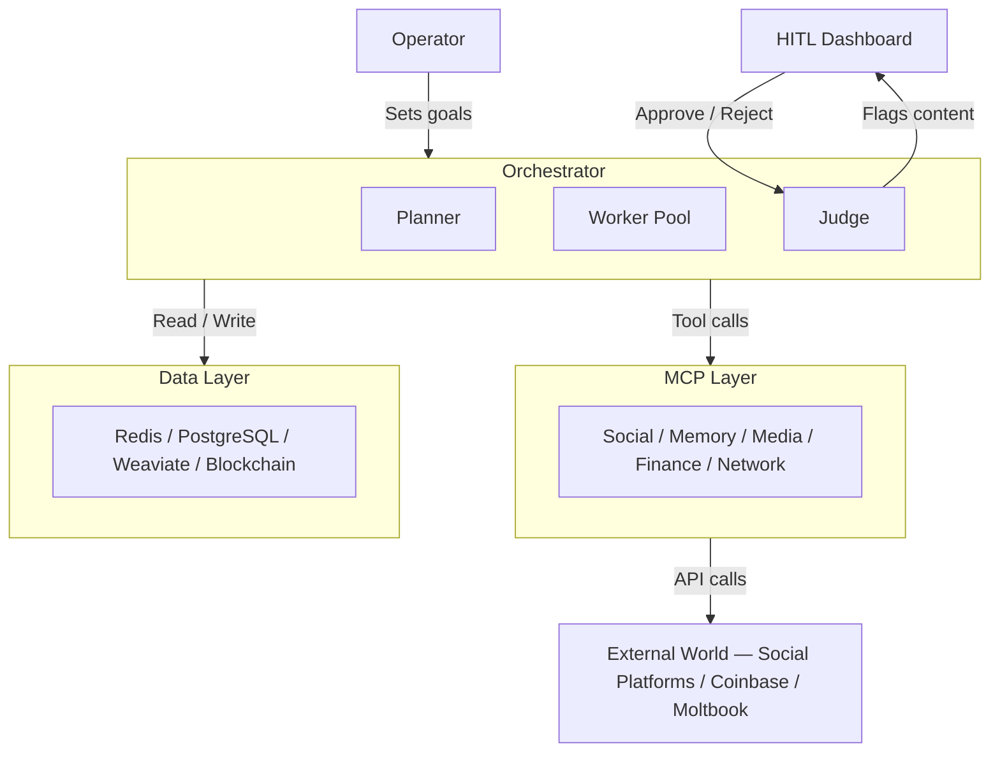

# Project Chimera — Autonomous Influencer Network

A platform for operating 1,000+ autonomous AI influencer agents at scale — each with a persistent persona, long-term memory, and economic agency.

---

## What is this?

Managing AI influencer agents at scale is an orchestration problem. One agent is easy; a thousand running simultaneously is not. Chimera solves this with a **FastRender Swarm**: a Planner-Worker-Judge architecture where stateless Workers execute tasks in parallel via Java Virtual Threads, all external calls route through MCP servers, and every financial transaction is gated by a CFO Sub-Judge. A single operator can govern the full fleet without reviewing every routine post.

---

## Architecture



**Planner** decomposes campaign goals into a task DAG and pushes to Redis. **Workers** pop one task each via Virtual Threads, call an MCP tool, and push results. **Judge** scores confidence, enforces safety rules, and commits or escalates.

---

## Project Structure

```
specs/          Approved specifications — read before writing any code
src/            TDD test suite (intentionally failing — defines the implementation target)
skills/         OpenClaw-compatible modular capability packages (download, transcribe)
research/       Architectural decisions and system overview diagrams
docs/           Day 1 report, research summaries, source PDFs
.specify/       Constitution, task breakdown, and 68-task implementation checklist
.github/        CI pipeline (spec-check → build → test → lint → PR comment)
```

---

## Quick Start

**Prerequisites:** Java 21, Maven 3.9+, Docker 25+, Redis 7+

```bash
git clone https://github.com/your-org/project-chimera.git
make setup   # compile + install dependencies
make test    # run JUnit 5 suite
make lint    # run Checkstyle
```

---

## Key Concepts

- **Spec-Driven Development** — no implementation code without an approved spec in `specs/`. Enforced by `CLAUDE.md`, Checkstyle, and CodeRabbit. The sequence is always: Spec → Plan → Tasks → Implementation.
- **TDD — tests fail first by design** — the files in `src/test/` are intentionally failing at compile time. They define the contract. Implementation comes after.
- **MCP — all external calls go through the MCP layer** — no provider SDK (Twitter, Coinbase, Instagram) appears in business logic. Every external action is an `MCPToolCall` routed through a dedicated server.

---

## Roadmap

- [ ] Phase 1: Core Swarm — Planner, Worker, Judge, Redis queues, PostgreSQL OCC
- [ ] Phase 2: MCP Integration — all 8 MCP server adapters, end-to-end content pipeline
- [ ] Phase 3: Agentic Commerce — CFO Sub-Judge, wallet provisioning, on-chain transactions
- [ ] Phase 4: OpenClaw Network — Moltbook status broadcast, peer discovery, injection defence
