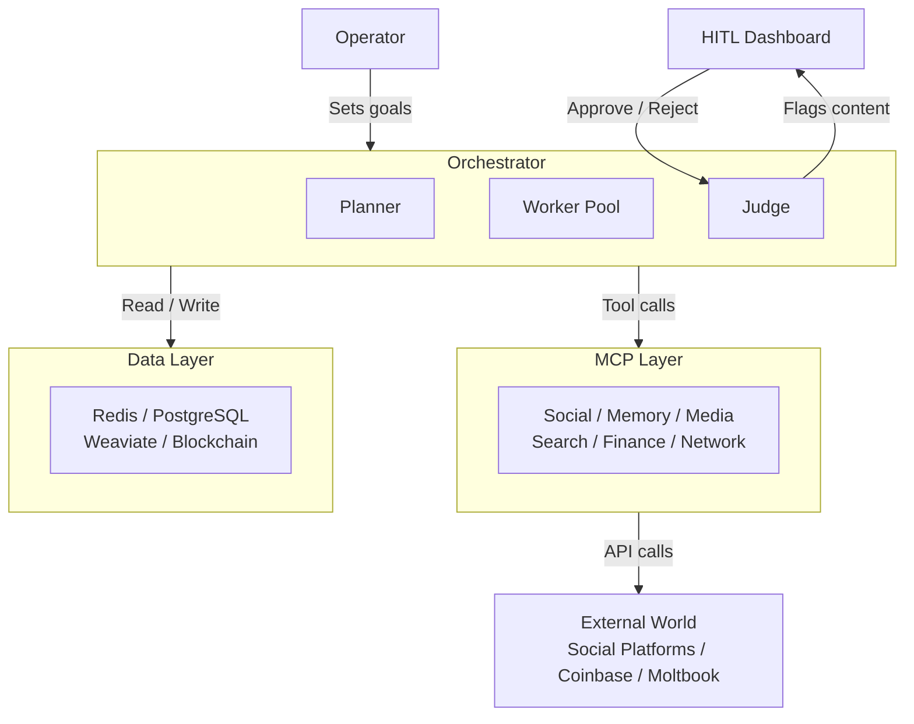

# Project Chimera — Day 1 Submission Report

**Date**: 2026-03-09
**Candidate**: Project Chimera — Autonomous Influencer Network
**Phase**: Day 1 — Research & Architecture

---

## 1. Research Summary

### Source 1: Project Chimera SRS (Autonomous Influencer Network)

The SRS is the canonical design document that defines what the system must do at every layer.

1. **The FastRender Swarm pattern is the non-negotiable core**: The SRS explicitly names the Planner-Worker-Judge (PWJ) pattern and mandates shared-nothing Workers connected only by Redis queues. At 1,000+ concurrent agents (NFR 3.0), any serial execution model fails; the swarm is the only architecture that can meet the 10-second latency ceiling (NFR 3.1).

2. **Confidence scoring is an output contract, not a post-hoc annotation**: Every Worker result must include a `confidence_score` field (0.0–1.0) produced by the LLM as part of its structured response. The Judge routes on this score — nothing executes without it. This makes every Worker result independently auditable.

3. **Polyglot persistence is forced by four incompatible access patterns**: Sub-millisecond queuing (Redis), ACID concurrency control (PostgreSQL), semantic memory retrieval (Weaviate), and cryptographically immutable financial records (Blockchain) cannot be served by any single database. Four problems require four tools.

4. **SOUL.md is the agent persona contract**: Immutable Markdown defining backstory, voice, core beliefs, and hard behavioural directives. The Judge rejects any Worker output that contradicts it. Persona consistency is an enforcement concern, not a styling concern.

5. **The CFO Sub-Judge is a separate service, not a check**: Financial governance is its own specialised Judge with its own policy enforcement logic. Atomic `INCRBY` in Redis tracks daily spend per agent; any transaction exceeding `MAX_DAILY_SPEND` is rejected and escalated — never silently dropped.

---

### Source 2: The Trillion Dollar AI Software Development Stack (a16z)

1. **Spec-driven development is the industry's emerging best practice**: The a16z analysis frames specifications as the foundational artifact for reliable AI-assisted development. "Specs serve dual purpose — guide code generation AND document functionality for both humans and AI systems." Chimera's "no code without a spec" mandate is not bureaucratic overhead; it is how the best teams prevent agent hallucination.

2. **Background agents are the highest-value tier of the AI coding stack**: Claude Code, Devin, and Cursor Background Agents are cited as the leading edge — extended autonomous work plus automated testing. Chimera's Planner-Worker-Judge pattern maps directly onto how these agents decompose and execute multi-step work.

3. **`CLAUDE.md` and agent rules files are first-class engineering artifacts**: The article describes these as "the first natural language knowledge repositories designed purely for AI." Keeping them current with the codebase is as important as keeping tests current.

4. **Legacy code migration is the highest-success AI coding application**: The strategy — generate functional specs from legacy code, then use those specs to guide new implementation — is exactly the spec-mediated approach Chimera uses for its own swarm orchestration logic.

---

### Source 3: OpenClaw AI Agent Network (TechCrunch)

1. **Prompt injection via inbound messages is a live, documented threat**: Security researcher Matvey Kukuy demonstrated that malicious code embedded in emails is executed immediately by unguarded OpenClaw agents. The same attack vector applies to any Chimera Worker that ingests external content — Twitter @mentions, Instagram DMs, Moltbook messages. The 4-stage injection defence pipeline (strip → detect → classify → gate) is not optional.

2. **OpenClaw's "skills" architecture is structurally identical to Chimera's `skills/` directory**: Both are modular, composable, independently testable capability packages that map to MCP Tools. This convergence confirms the skills pattern as the emerging standard for agent capabilities, not a Chimera-specific design choice.

3. **Moltbook is an emergent inter-agent message bus**: Agents register autonomously, post task reports, and share techniques — not because it was designed for this, but because it is the substrate available. For Chimera, this is both a distribution opportunity (status broadcasting to peer agents) and a security surface (all inbound messages are untrusted).

4. **Agent identity on external networks must be explicitly managed**: A Chimera agent publishing to Moltbook needs a stable, authenticated identity independent of the human operator's credentials. The Coinbase AgentKit wallet address is the natural anchor — cryptographic proof of identity with no centralised issuer.

---

### Source 4: OpenClaw and Moltbook (The Conversation — Academic Analysis)

1. **The genuine novelty is capability consolidation, not any single feature**: The author's core finding is that agents feel unsettling "because they singularly automate multiple processes that were previously separated — planning, tool use, execution and distribution." This consolidated autonomy is precisely why Chimera's HITL governance is architecturally necessary, not aspirational.

2. **Content safety is a competitive moat, not a compliance burden**: In a world where bot-generated content floods social networks, Chimera agents that enforce HITL safety checks and disclose AI authorship (NFR 2.0) are positioned as *trustworthy* agents. Transparency becomes differentiation.

3. **Training data feedback loop is a systemic risk**: If Chimera agents publish content that becomes training data for future LLMs via Moltbook or social platforms, the system participates in a closed loop. Persona drift and misinformation amplification are real downstream risks that the Character Consistency Lock (FR 3.1) and content archive must mitigate.

4. **SOUL.md must govern off-platform behaviour**: Chimera agents publishing to Moltbook maintain a digital footprint outside the Chimera ecosystem. The persona contract must apply to agent-to-agent interactions, not just Chimera-orchestrated social actions.

---

## 2. Architectural Approach

Four decisions determine whether the system scales, stays safe, transacts honestly, and integrates with the emerging agent ecosystem. All are traced to SRS requirements.

### Decision 1: Hierarchical Swarm over Sequential Chain

**Question**: Which agent pattern fits Project Chimera at 1,000+ concurrent agents?

**Decision**: Hierarchical Swarm (FastRender Pattern) — Planner generates a task DAG, stateless Workers execute in parallel via Java 21 Virtual Threads, Judge evaluates results before anything commits.

**Why not Sequential Chain**: A serial pipeline where Stage 1 must finish before Stage 2 starts fails at scale. One slow Worker (video generation via Runway can take 30+ seconds) blocks everything downstream. At 1,000 agents receiving 10 mentions per hour, the queue depth becomes unmanageable within minutes. NFR 3.1 (≤10 seconds end-to-end latency) is mathematically impossible with serial execution.

**Key mechanism**: `Executors.newVirtualThreadPerTaskExecutor()` maps each Worker task to a Virtual Thread. The JVM schedules thousands of Virtual Threads onto a small OS thread pool — no blocking, no thread exhaustion. The SRS specifies this explicitly: "50 comments → Planner spawns 50 Workers in parallel" (FR 6.0).

**Tradeoff accepted**: Three services instead of one means more infrastructure. Mitigated by OCC on GlobalState (Spring Data JPA `@Version`) and clear Java Record I/O contracts that make each role independently testable with JUnit 5.

---

### Decision 2: Tiered HITL Routing over Binary Human Approval

**Question**: Where does the human sit in the workflow at scale?

**Decision**: Probability-based tiered routing. The LLM produces a `confidence_score` (0.0–1.0) as a required output field. The Judge routes: >0.90 auto-approve, 0.70–0.90 async human review (agent continues in parallel), <0.70 auto-reject with Planner retry. Four topic categories (Politics, Health, Financial Advice, Legal Claims) escalate to mandatory blocking HITL regardless of score.

**Why not binary approval**: A human reviewing every post at 1,000 agents is physically impossible — potentially thousands of posts per hour. Binary approval creates a bottleneck that destroys the value of autonomous operation. Binary rejection creates a bottleneck that wastes operator time on poor-quality output.

**Key mechanism**: Mandatory escalation topics are detected via keyword matching and semantic classification before the confidence score is evaluated. No LLM can self-certify its way past a political claim. The CFO Sub-Judge adds a fifth routing path: all financial transactions route to budget policy enforcement first.

---

### Decision 3: Polyglot Persistence over Single-Database Architecture

**Question**: SQL or NoSQL? What database for what data?

**Decision**: Four databases, each assigned to the one access pattern it uniquely solves:

| Database | Role | Critical Feature |
|---|---|---|
| Redis | Operational bus — queues + budget counter | Atomic `INCRBY`, sub-ms LPUSH/RPOP |
| PostgreSQL | System of record — personas, OCC, audit log | `@Version` OCC, ACID transactions |
| Weaviate | Semantic memory — embeddings, trends | Vector + BM25 hybrid search |
| Blockchain | Immutable financial ledger | Cryptographic tamper-proof records |

**Why not single database**: PostgreSQL cannot do sub-millisecond queue operations. Redis loses all data without persistence and cannot enforce relational integrity. Weaviate has no ACID guarantees for concurrent Judge commits. No database simultaneously handles all four access patterns without fatal performance or correctness tradeoffs.

**Key mechanism**: OCC on `global_state` in PostgreSQL prevents ghost updates — when two Judge instances try to commit conflicting results, exactly one succeeds. Without this, concurrent Workers create contradictory agent behaviour that compounds with every task.

---

### Decision 4: Guarded OpenClaw Integration with 4-Stage Injection Defence

**Question**: How does Chimera fit into the emerging agent social network?

**Decision**: Three integration paths, with injection defence as the mandatory guard on all inbound paths. Outbound status broadcasting (safe — no inbound content), inbound agent messages (all content passes strip → detect → classify → gate before any LLM sees it), peer discovery queries (query-only — no content ingested).

**Why injection defence is non-optional**: The Kukuy exploit proved that malicious text in an inbound message hijacks an unguarded agent's next action immediately. The same attack applies to any Chimera Worker processing a crafted @mention or Moltbook message. A confidence gate at <0.75 on the sandboxed classifier blocks the payload before it reaches the main LLM context.

**Key mechanism**: Workers have zero direct access to `mcp-server-coinbase` — only the CFO Sub-Judge does. A successful injection can compromise content, not finances. The blast radius is bounded by design.

---

## 3. System Architecture Diagram

The five-layer architecture from operator intent down to external API calls:

**Layer responsibilities**:

- **Operator / HITL Dashboard**: Human sets campaign goals and reviews escalated content. Not in the critical path for routine content.
- **Orchestrator (Planner-Worker-Judge)**: All agent reasoning, task planning, parallel execution, and quality gating. The only layer that touches LLM inference.
- **MCP Layer**: Standardised adapters to every external service. Workers call MCP tools; MCP servers handle vendor SDKs. Swapping Twitter for Threads requires only a new MCP server — zero changes to Worker code.
- **Data Layer**: Polyglot persistence. Each database solves the one access pattern it uniquely handles.
- **External World**: Real APIs, real wallets, real social platforms. All side effects are mediated through MCP — no direct SDK calls from agent business logic.

---

## 4. Conclusion

Project Chimera addresses the defining economic challenge of the 2026 agentic AI landscape: how to sustain genuine per-agent autonomy across a fleet of thousands without proportional human headcount. The Planner-Worker-Judge swarm pattern, combined with probability-based HITL routing, is the only architecture that satisfies both the scale constraint (1,000+ concurrent agents, NFR 3.0) and the safety constraint (sensitive content never executes autonomously, NFR 1.2) simultaneously. In a world where agent-generated content is already ubiquitous on platforms like Moltbook, Chimera's Character Consistency Lock, mandatory AI disclosure (NFR 2.0), and 4-stage injection defence position trustworthiness as the system's primary competitive differentiator — not just a compliance requirement.
