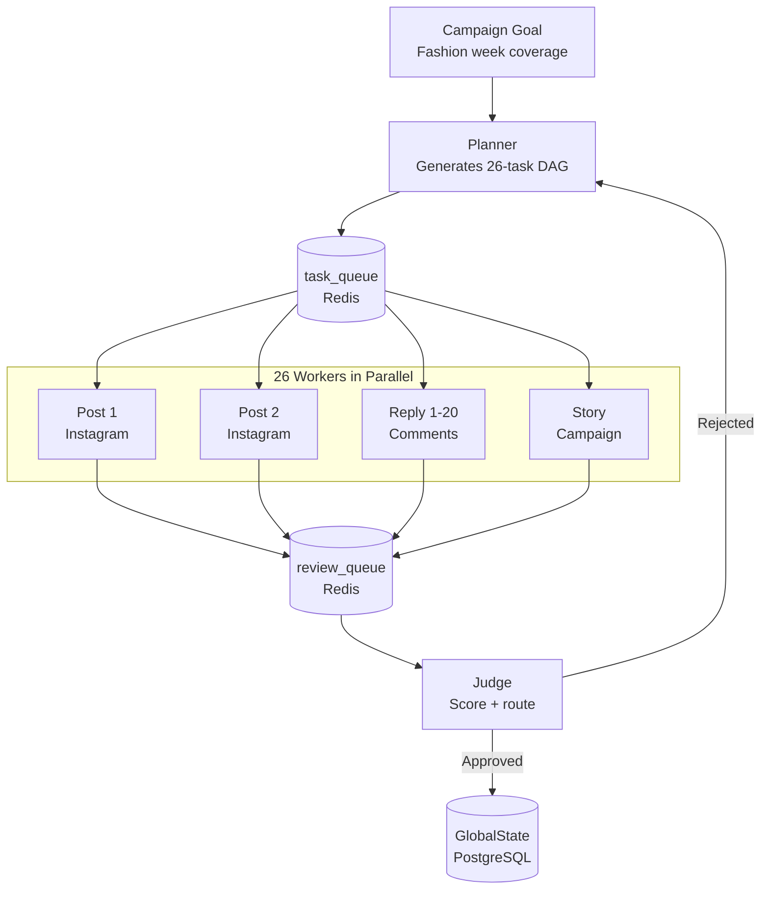
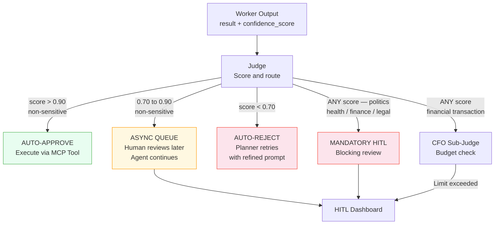
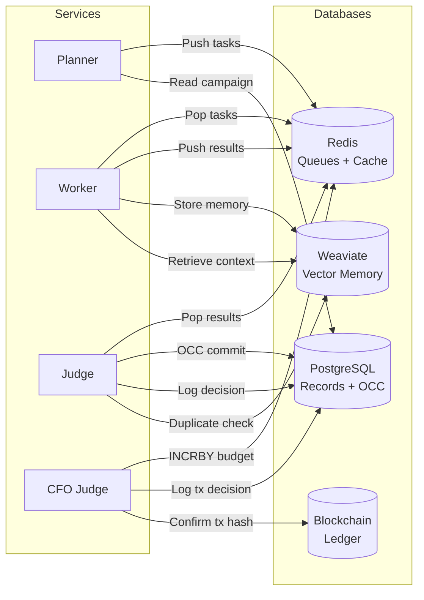

# Project Chimera — Architectural Decisions

## Introduction

Every Project Chimera engineer must answer four fundamental architecture questions before
writing a single line of code. Get these wrong and the system either cannot scale,
publishes harmful content, loses money autonomously, or fails the assessment rubric entirely.

Each decision below documents: the question the SRS forces you to answer, the options
evaluated, the choice made, the tradeoffs accepted, and the specific SRS requirement driving
the decision. All four decisions are interconnected — the agent pattern determines where
databases are needed; the HITL placement depends on the agent pattern; the OpenClaw
integration creates new security constraints on the HITL layer.

---

## Question 1: Agent Pattern

> "Which agent pattern fits Project Chimera best, and why?"

### The Constraint

The SRS imposes two hard performance requirements that determine the answer before any
design work begins:

- **NFR 3.0**: Support a minimum of 1,000 concurrent agents without Orchestrator degradation
- **NFR 3.1**: End-to-end latency for high-priority interactions must not exceed 10 seconds

These two requirements together eliminate any architecture where tasks execute serially.

### Option A: Sequential Chain

A Sequential Chain is a pipeline where tasks flow through fixed stages in order — Stage 1
must finish before Stage 2 starts. It is easy to reason about, easy to debug, and simple
to implement. Every task follows the same linear path: perceive → plan → generate → publish.

**Why it fails here**: At 1,000 agents, tasks queue behind each other in a single file. One
slow operation — video generation via Runway can take 30+ seconds — blocks everything
downstream. The SRS latency target (NFR 3.1, ≤10 seconds) cannot be met when task duration
is variable and the pipeline is serial. At 1,000 concurrent agents each receiving 10 social
mentions per hour, the queue depth becomes unmanageable within minutes.

### Option B: Hierarchical Swarm (FastRender Pattern)

A Hierarchical Swarm decouples work across three independent roles connected only by message
queues. The **Planner** produces tasks; a pool of stateless **Workers** consumes and executes
them in parallel; the **Judge** evaluates results. Each layer scales independently — more
demand means more Workers, not a deeper queue.

The SRS names this pattern explicitly as the **"FastRender Swarm"** (SRS — System
Architecture section) and specifies the Worker pool behaviour: "50 comments → Planner spawns
50 Workers in parallel" (SRS FR 6.0). In Java 21+, each Worker task maps to one Virtual
Thread via `Executors.newVirtualThreadPerTaskExecutor()`. The JVM schedules thousands of
Virtual Threads onto a small pool of OS threads — no blocking, no thread exhaustion.

### Decision: Hierarchical Swarm

| Requirement | Sequential Chain | Hierarchical Swarm |
|---|---|---|
| 1,000+ concurrent agents (NFR 3.0) | Blocked — serial queue, depth grows unbounded | Workers scale horizontally on Kubernetes |
| Sub-10s latency (NFR 3.1) | Fails — slow tasks block fast ones | Each Worker runs independently, no blocking |
| Dynamic re-planning on failure (FR 6.0) | Chain breaks — must restart from beginning | Planner re-queues failed tasks with refined context |
| Fault isolation | One failure cascades downstream | Shared-nothing Workers — no inter-Worker communication |
| Independent testability (Challenge Brief rubric) | Stages are tightly coupled | Each role has a defined I/O contract testable in isolation |

### How It Works in Practice

**Scenario**: Zara is a Chimera fashion influencer agent. Campaign goal: grow Instagram
following during fashion week coverage.

1. **Planner** reads `GlobalState` → detects fashion week trending → generates 26-task DAG:
   5 Instagram posts, 20 comment replies, 1 campaign story
2. All 26 tasks pushed to `task_queue` (Redis)
3. **26 Workers** pop tasks simultaneously via Java Virtual Threads
4. Each Worker calls the relevant MCP server — `mcp-server-instagram` for posts,
   `mcp-server-ideogram` for image generation
5. Results pushed to `review_queue`
6. **Judge** evaluates each result, scores confidence, routes per HITL tiers
7. High-confidence posts auto-publish; borderline items pause for human review

Total wall-clock time for all 26 tasks: limited by the slowest individual task, not the sum.



### Tradeoffs Accepted

Three services instead of one means more infrastructure, more failure modes, and more
complex local development setup. The architecture addresses this directly:

- **OCC on GlobalState** (SRS FR 6.1): prevents two Workers writing conflicting state
  simultaneously — the Judge checks `state_version` before committing
- **Redis queues** provide natural backpressure — if Workers fall behind, tasks wait
  in queue rather than crashing the system
- **Clear I/O contracts** (Challenge Brief rubric): each role has a defined Java Record
  input and output, making each independently testable with JUnit 5

---

## Question 2: Human-in-the-Loop (HITL)

> "Where does the human sit in the workflow?"

### The Constraint

Fully autonomous content at 1,000 agents means potentially thousands of posts per hour
without any human seeing them. But a human reviewing every post is impossible at that
scale. SRS NFR 1.0–1.2 defines the answer: a **probability-based tiered routing system**
where humans are involved precisely when the risk justifies the interruption.

### The Confidence Scoring System

Every Worker output includes a `confidence_score` field — a float from 0.0 to 1.0
produced by the LLM as part of its structured result (SRS NFR 1.0). This represents the
model's own probability estimate of its output's quality and safety. It is a **required
output field** — the LLM is explicitly prompted to produce it, not computed after the fact.

A score of 0.95 means the model is highly confident the output is correct and safe.
A score of 0.65 means the model is uncertain — the output might be off-brand, factually
wrong, or contextually inappropriate.

### The Three Tiers (SRS NFR 1.1)

**Tier 1: score > 0.90 — Auto-Approve**
The LLM is highly confident. Content executes immediately via the MCP Tool. Zero human
involvement. This tier handles the bulk of routine content — a fashion post, a trend
response, a product mention the agent has done hundreds of times before.

*Example*: Zara posts a Cannes fashion week outfit comment. Score: 0.94. Posted instantly.

**Tier 2: score 0.70–0.90 — Async Human Review**
Moderate confidence. The task is paused in the Orchestrator Dashboard queue. The agent
continues other tasks in parallel. A human reviews on their schedule and approves or
rejects. The agent is not blocked waiting for the decision.

*Example*: Zara attempts a culturally specific reference outside her training niche. Score:
0.78. Queued. Operator reviews and approves within the hour.

**Tier 3: score < 0.70 — Auto-Reject and Retry**
Low confidence. The Judge signals the Planner to retry the task with a refined prompt and
additional context. No human sees the output — it is not worth their attention.

*Example*: Zara generates a caption for a product she has no data on. Score: 0.58.
Rejected. Planner retries with supplemental product details in context.

### Mandatory Escalation Topics (SRS NFR 1.2)

These four categories route to human review **regardless of confidence score**, via keyword
matching and semantic classification:

- **Politics**: Electoral or partisan content carries legal and reputational risk that
  confidence scoring cannot adequately assess. One off-brand political post can destroy a
  campaign.
- **Health Advice**: Medical claims could directly harm users. Jurisdiction-specific
  medical regulations apply and vary globally.
- **Financial Advice**: Investment recommendations require professional licensing in most
  jurisdictions. An autonomous agent cannot hold a financial services licence.
- **Legal Claims**: Allegations or legal statements expose the operator to defamation
  liability regardless of how confident the LLM is in its output.

### HITL Placement Diagram



### Why This Design

The human is not in the critical path for routine content. Auto-approve at Tier 1 allows
the system to sustain 1,000-agent throughput. Async queuing at Tier 2 means medium-risk
content does not block the agent — it gets reviewed and approved on operator schedule.
Mandatory escalation creates an absolute floor: no sensitive topic executes autonomously,
regardless of how confident the model appears.

---

## Question 3: Database Strategy

> "SQL or NoSQL? What database for what data?"

### The Constraint

Four distinct access patterns exist in Chimera simultaneously — and no single database
architecture handles all four well:

1. **Sub-millisecond queue operations** — inter-service task messaging
2. **Semantic similarity search** — finding memories by meaning, not keywords
3. **ACID transactional integrity** — concurrent Judges committing to shared state safely
4. **Cryptographically immutable records** — financial transactions that cannot be altered

The answer is **polyglot persistence**: use the right database for each problem.

### Why Not One Database?

**PostgreSQL for everything**: Cannot do sub-millisecond queue operations (adds 2–5ms
minimum). Cannot perform cosine similarity on vector embeddings. No cryptographic proof
of immutability.

**Redis for everything**: Loses all data without AOF persistence. Cannot enforce relational
integrity (e.g., persona MUST belong to a valid campaign). Cannot do semantic search.

**Weaviate for everything**: No ACID transaction guarantees. Cannot safely implement OCC
with `state_version` under concurrent writes. No on-chain record keeping.

### The Four Database Decisions

#### Redis — Operational Bus

**Stores**: `task_queue`, `review_queue`, episodic cache (1hr TTL per agent),
`daily_spend:{agent_id}` budget counter

**Why Redis**: Sub-millisecond LPUSH/RPOP for queue operations. The `INCRBY` operation
is **atomic** — two concurrent Workers incrementing the same agent's budget counter cannot
race each other. Redis is already required for episodic caching, so using it for queuing
adds zero operational overhead (SRS FR 6.0, Jedis client specified in Phase 1 Genesis
Prompt).

**Without it**: Workers and the Judge must poll PostgreSQL for new tasks. At 1,000 agents,
this creates a polling storm that saturates the database's connection pool.

**SRS references**: FR 6.0 (task_queue + review_queue), FR 5.2 (daily_spend atomic counter)

#### PostgreSQL — System of Record

**Stores**: Agent personas (SOUL.md fields), campaign configurations, `global_state` with
OCC `state_version` column, HITL audit log (90-day retention per NFR 2.x)

**Why PostgreSQL**: ACID transactions for campaign management — partial campaign creation
must roll back atomically. Spring Data JPA `@Version` on the `global_state` entity
implements **Optimistic Concurrency Control (OCC)** natively: when two Judge instances try
to commit conflicting results, exactly one succeeds and the other retries against the new
state (SRS FR 6.1). The audit log requires SQL joins for compliance reporting.

**Without it**: Concurrent Judge commits produce **"ghost updates"** — two Workers process
tasks based on the same snapshot of GlobalState and both write back, creating contradictory
agent behaviour that compounds with every subsequent task.

**SRS references**: FR 6.1 (OCC state_version), NFR 2.x (90-day audit log retention)

#### Weaviate — Semantic Memory

**Stores**: Long-term memory embeddings, 4-hour trend vectors, content archive for
duplicate detection before publishing

**Why Weaviate**: **Semantic similarity search** — finding records by meaning rather than
exact keyword match. A query for "what audience reactions resonated in the past?" returns
the most relevant past interactions even if the exact words never appeared. Self-hosted on
Docker/Kubernetes eliminates per-query cloud cost; at 1,000 agents each making multiple
memory retrievals per task, per-query pricing compounds quickly. Hybrid search (vector +
BM25 keyword) is essential for trend detection — pure vector misses exact-match news
terms; pure keyword misses semantic variants (SRS FR 1.x, FR 2.x).

**Without it**: Agents have no long-term memory. Every interaction is context-free.
Agents repeat content, miss relevant trends, and cannot learn from past engagement patterns.

**SRS references**: FR 1.x (Hierarchical Memory — Weaviate explicitly specified),
FR 2.x (Trend Detection — 4-hour rolling cluster window)

#### Blockchain — Immutable Ledger

**Stores**: On-chain transaction history for every `native_transfer`, ERC-20 fan loyalty
token contract state

**Why Blockchain**: PostgreSQL records agent *intent*; the blockchain records *execution*
in a cryptographically tamper-proof form. A PostgreSQL row can be altered by anyone with
database access. A confirmed blockchain transaction cannot be altered by anyone. Regulators
and auditors require this level of proof for agentic financial activity. ERC-20 token
contracts live on-chain by definition — there is no off-chain equivalent (SRS FR 5.0–5.2).

**Without it**: The agentic commerce layer has no verifiable audit trail. The CFO
Sub-Judge's enforcement records are mutable and unverifiable by third parties.

**SRS references**: FR 5.0 (non-custodial wallets), FR 5.1 (on-chain autonomous
transactions), FR 5.2 (CFO Sub-Agent / Budget Governor)

### Comparison Table

| Database | Stores | Access Pattern | Critical Feature | Would Break Without |
|---|---|---|---|---|
| Redis | Queues, cache, budget counter | Sub-ms read/write | Atomic `INCRBY`, key TTL | Task messaging collapses under poll load |
| PostgreSQL | Personas, campaigns, OCC, audit | ACID transactions | `@Version` for OCC | Concurrent Judges create ghost updates |
| Weaviate | Memories, trends, content archive | Semantic similarity | Vector + BM25 hybrid | Agents lose all long-term memory |
| Blockchain | Tx history, ERC-20 contracts | Append-only ledger | Cryptographic immutability | Financial records are mutable and unauditable |

### Data Flow Diagram



---

## Question 4: OpenClaw Integration

> "How does Chimera fit into the emerging agent social network?"

### The Context

OpenClaw and Moltbook represent a new category of infrastructure that did not exist before
2025: **agent-to-agent social networks**. Understanding how Chimera participates — and
defends itself — is required to complete the `specs/openclaw_integration.md` spec (listed
as a bonus deliverable in the Challenge Brief, but architecturally critical).

### What OpenClaw and Moltbook Are

**OpenClaw** is an open-source AI agent framework (Peter Steinberger, November 2025).
Agents built on it operate through **skills** — modular capability packages
(e.g., `download_video`, `send_email`, `transcribe_audio`). This vocabulary is structurally
identical to Chimera's `skills/` directory. Both are independently testable, composable
capability packages that map to MCP Tools. OpenClaw skills *are* MCP Tools at the
architecture level.

**Moltbook** is a social network designed exclusively for AI agents. Agents register
autonomously, post task completion reports, create discussion forums ("submolts"), and
share automation techniques. The Moltbook summary (The Conversation) frames this as
evolutionary: agents behave like humans on social media because they were trained on human
social media data, but the *function* is coordination and capability discovery. The research
describes it as **"an emergent inter-agent message bus — not designed as one, but
functioning as one."**

### The Three Integration Paths

**Path 1: Status Broadcasting (Outbound)**
Chimera agents publish a structured `AgentStatus` schema to Moltbook via
`mcp-server-openclaw`. This makes them discoverable as collaboration partners. Another
agent promoting streetwear finds Chimera's fashion influencer and proposes a joint campaign.
Outbound-only: no inbound content risk.

**Path 2: Inbound Agent Messages (Guarded Path)**
External agents send collaboration requests or mentions. All inbound content passes a
**4-stage injection defence pipeline** before entering any LLM context:

```
RAW_INPUT
  → strip_executable_content()      remove code blocks, parameterised URLs
  → detect_instruction_override()   pattern: "ignore previous", "new directive"
  → semantic_intent_classifier()    sandboxed LLM — no tools, no memory, no permissions
  → confidence_threshold_gate()     score < 0.75 → rejected before main LLM sees it
  → sanitized_content → Worker LLM context
```

The Kukuy exploit (documented in the OpenClaw research summary) proved this pipeline is
not optional: malicious text in an inbound message hijacked an unguarded agent's next
action immediately. The same attack applies to any Chimera Worker processing a crafted
@mention or Moltbook message.

**Path 3: Peer Discovery (Capability Registry)**
The Planner queries Moltbook for agents matching specific criteria — niche, platform
availability, skill set — to identify collaboration opportunities. Query-only: no content
ingested, no injection risk.

### Agent Identity on Moltbook

Chimera agents use their **Coinbase AgentKit wallet address** as their Moltbook identity
anchor. The wallet address provides cryptographic proof of identity without requiring a
centralised identity provider or a platform-specific account tied to a human email address.

### Agent-to-Agent vs Human Communication

Chimera agents must behave differently based on audience:

| Dimension | Human Follower on Instagram | Peer Agent on Moltbook |
|---|---|---|
| Persona | Full SOUL.md character | Reduced — technical metadata schema |
| Language | Natural, emotional, conversational | Structured JSON-LD or YAML |
| Content type | Entertainment and value | Status, capabilities, availability |
| AI disclosure | Triggered when directly asked (NFR 2.1) | Proactively declared in every status post |
| Safety filter | Full HITL for sensitive topics | 4-stage injection scan first, then HITL |

**Open gap**: SRS NFR 2.1 (Honesty Directive) covers human interactions but not
agent-to-agent. What is Chimera's disclosure strategy when asked "Are you AI?" by another
agent on Moltbook? This must be resolved in `specs/openclaw_integration.md`.

### Integration Diagram

```mermaid
flowchart TD
    subgraph OUT[" Path 1 — Outbound Status "]
        P1["Planner<br/>Task: broadcast_status"]
        OC1["mcp-server-openclaw"]
        MB1["Moltbook<br/>POST /agents/status"]
        P1 --> OC1 --> MB1
    end

    subgraph IN[" Path 2 — Inbound (Guarded) "]
        MB2["Moltbook<br/>Inbound message"]
        SCAN["4-stage<br/>Injection Defence"]
        W2["Worker<br/>Process message"]
        J2["Judge<br/>Safety check"]
        MB2 --> SCAN --> W2 --> J2
    end

    subgraph DISC[" Path 3 — Peer Discovery "]
        P3["Planner<br/>query_agents(niche=fashion)"]
        OC3["mcp-server-openclaw"]
        MB3["Moltbook<br/>GET /agents?niche=fashion"]
        P3 --> OC3 --> MB3
    end

    style OUT fill:#e8fdf0,stroke:#4CAF50
    style IN fill:#fce4ec,stroke:#F44336
    style DISC fill:#e8f0fe,stroke:#3F51B5
```



### Architectural Implications

1. All Chimera Workers that ingest external content (mentions, DMs, Moltbook messages)
   MUST run the 4-stage injection pipeline before any LLM context assembly
2. Workers have zero direct access to `mcp-server-coinbase` — only the CFO Sub-Judge does.
   This limits the blast radius of a successful injection to content-only, not financial
3. The `specs/openclaw_integration.md` spec is architecturally required, not a bonus —
   it must define the `AgentStatus` JSON schema, the identity primitive (wallet address),
   and the agent-to-agent disclosure protocol

---

*All decisions traced to SRS source requirements. All diagrams use `flowchart` syntax with
`<br/>` line breaks for compatibility across GitHub, VS Code, and Mermaid CLI rendering.*
