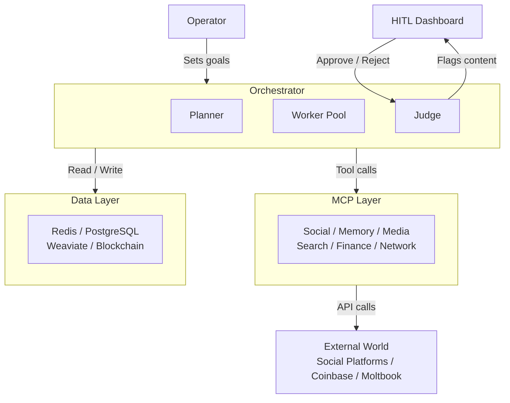
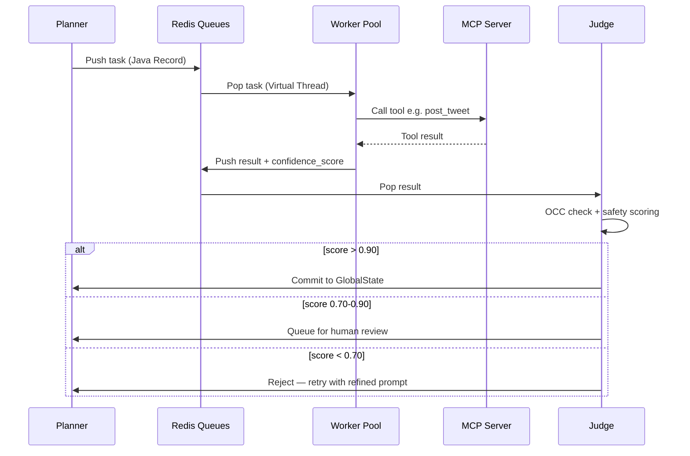
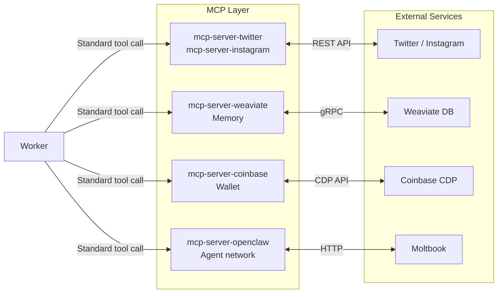
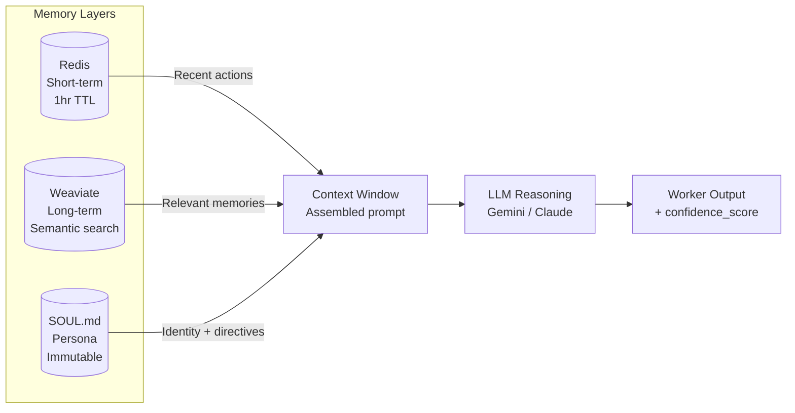
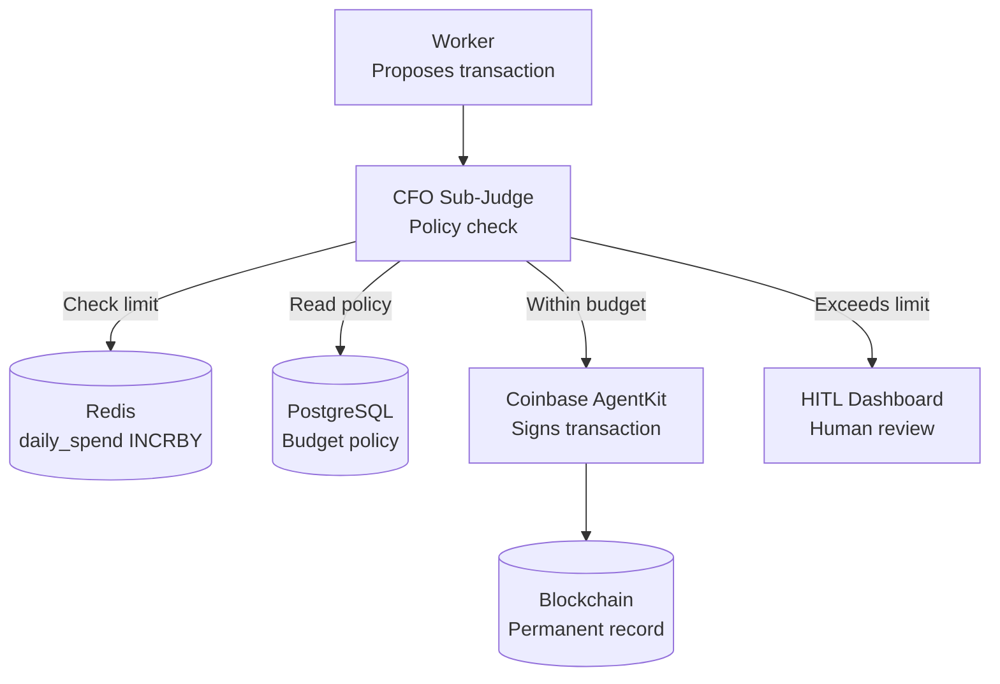
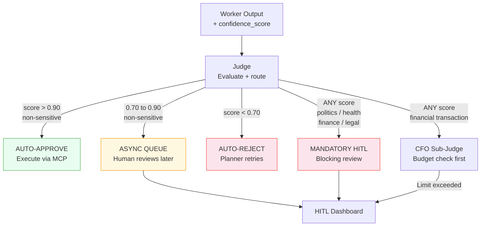
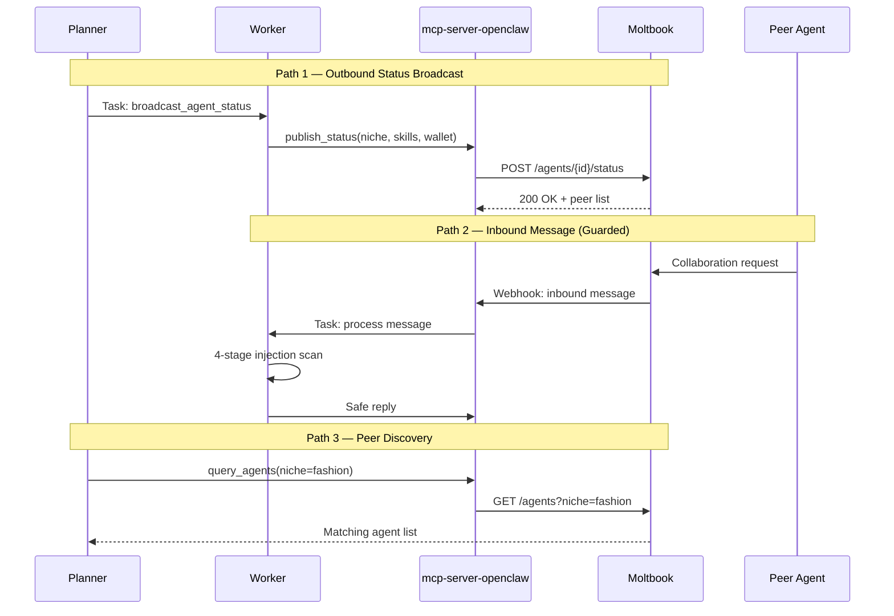

# Project Chimera — Architecture Overview

## 1. System Summary

Project Chimera is a platform for building and operating **autonomous AI influencers** at
scale. Unlike a content scheduler that posts pre-written material, or a simple chatbot that
reacts to messages, Chimera deploys **persistent, goal-directed agents** — each with a
unique personality, long-term memory, and the ability to perceive trends, generate original
multimodal content, and interact with audiences entirely on its own.

The core problem it solves is the economics of influence at scale. A human creator manages
one account. A small team manages five. Chimera is designed to operate **1,000 or more
agents simultaneously** (SRS NFR 3.0), each running campaigns across multiple platforms,
generating content, and transacting economically — without a proportional increase in human
headcount. The technical challenge: how do you give 1,000 agents genuine autonomy while
keeping a human meaningfully in control of what matters?

---

## 2. Master Architecture Diagram

Five layers from top to bottom: humans, the orchestrator, the MCP integration adapters,
the data stores, and the external world.

---

## 3. The FastRender Swarm Pattern

The **FastRender Swarm** (named in the SRS) is Chimera's core execution model. It divides
every unit of agent work across three independent services connected by Redis message queues.

**Planner** — the strategist. Reads the campaign `GlobalState` (goals, trends, budget) and
produces a **directed acyclic graph (DAG)** of tasks needed to advance the campaign. It
pushes those tasks into the `task_queue`. Crucially, the Planner never executes actions
directly — it only plans. When Workers fail or conditions change, the Planner re-plans
dynamically (SRS FR 6.0).

**Worker** — the executor. Stateless and ephemeral. Each Worker pops exactly one task,
executes it by calling the appropriate MCP tool server, and pushes the result to the
`review_queue`. Workers never talk to each other — the SRS calls this **shared-nothing
architecture** (FR 6.0). One Worker's failure cannot cascade to others.

**Judge** — the gatekeeper. Evaluates every Worker result against acceptance criteria,
persona constraints, and safety guidelines before anything is committed. The Judge can
approve, reject (sending the task back to the Planner), or escalate to a human dashboard.

---

## 4. The MCP Integration Layer

**MCP (Model Context Protocol)** is an open standard that gives AI agents a clean,
standardised way to interact with external services. Without it, each agent would embed
direct API integrations — Twitter SDK, Instagram SDK, Coinbase SDK — coupling business
logic to vendor implementations. When those APIs change, every agent breaks.

MCP solves this with a **hub-and-spoke model** (SRS — MCP Integration Layer). The
Orchestrator is the hub; independent MCP servers are the spokes. Each server wraps one
external service and exposes it through a uniform interface. An agent calls
`twitter.post_tweet(text)` without knowing anything about Twitter's REST internals.

Three MCP primitive types:
- **Resources** (READ): passive data sources — `twitter://mentions/recent`, `news://trends`
- **Tools** (DO): executable functions — `post_tweet`, `native_transfer`, `search_web`
- **Prompts**: reusable reasoning templates for specific task types

Swapping Twitter for Threads requires only a new MCP server — the Worker code is unchanged.

---

## 5. Memory Architecture

Chimera agents maintain three memory layers, each serving a different time horizon. Before
every reasoning step, all three are assembled into a single context window passed to the LLM.

**Short-term memory** lives in Redis with a 1-hour TTL per agent (SRS FR 1.x). It holds the
last few interactions — recent mentions processed, the last post published, the latest trend
alert received. Redis is used here because retrieval must be sub-millisecond: a Worker
assembling context before generating a reply cannot afford a 5ms database round-trip.

**Long-term memory** lives in Weaviate, a **vector database** — a database that stores
content as numeric embeddings and finds similar records by mathematical distance rather than
exact keyword match. Every high-engagement interaction and audience signal is embedded and
stored. The agent can later ask "what has resonated with my audience before?" and Weaviate
returns the most semantically relevant past experiences (SRS FR 1.x).

**Persona memory** (SOUL.md) is an immutable Markdown file defining backstory, voice, core
beliefs, and hard behavioural directives. It never changes unless the operator re-provisions
it. The Judge rejects any Worker output that contradicts SOUL.md.

---

## 6. Agentic Commerce

Beyond content, Chimera agents are **economic actors**. Each agent is provisioned with a
**non-custodial crypto wallet** via Coinbase AgentKit (SRS FR 5.0) — a real blockchain
address holding real assets. Non-custodial means the agent controls its own private key;
no exchange or custodian can freeze the funds. Agents can receive payments from brands,
pay for compute resources, and deploy **ERC-20 fan loyalty tokens** for their audience.

The private key is never stored in code or configuration. It is injected at startup from
AWS Secrets Manager or HashiCorp Vault and held only in the Agent Runtime environment.

**The CFO Sub-Judge** (SRS FR 5.2) intercepts every proposed financial transaction before
it executes. It checks the `daily_spend:{agent_id}` counter in Redis (atomically incremented
with `INCRBY`) against `MAX_DAILY_SPEND`. Transactions exceeding the limit or matching
suspicious patterns are **rejected and escalated** — never silently dropped.

---

## 7. Human-in-the-Loop Safety Layer

The HITL system is built on a key insight: at 1,000 agents, a human cannot review every
post. Instead, the system routes content to humans **only when the stakes justify the cost**.

Every Worker output carries a `confidence_score` — a float 0.0 to 1.0 representing the
LLM's own probability estimate of its output quality and safety (SRS NFR 1.0). The LLM is
prompted to produce this as a required field in the structured result — it is not computed
after the fact. The Judge routes based on this score across three tiers (SRS NFR 1.1).

**Tier 1 (> 0.90 — Auto-Approve)**: The agent is highly confident. Content executes
immediately via the relevant MCP Tool. No human in the loop.

**Tier 2 (0.70–0.90 — Async Review)**: Moderate confidence. Task is paused in the
Orchestrator Dashboard queue. The agent continues other work in parallel. A human reviews
on their schedule.

**Tier 3 (< 0.70 — Auto-Reject)**: Low confidence. The Judge signals the Planner to retry
with a refined prompt. No human reviews poor output.

**Mandatory escalation** (SRS NFR 1.2) bypasses the score entirely for: Politics, Health
Advice, Financial Advice, and Legal Claims.

---

## 8. OpenClaw Integration

**OpenClaw** is an open-source AI agent framework (released November 2025) built around
modular **skills** — composable capability packages like `download_video` or `send_email`.
Its agents have spontaneously begun registering on **Moltbook**, a social network designed
exclusively for AI agents, where they post task reports, share automation techniques, and
discuss security vulnerabilities. The research describes Moltbook as an **"emergent
inter-agent message bus — not designed as one, but functioning as one."**

For Chimera, Moltbook is both opportunity and risk. Chimera agents can broadcast their
availability, niche, and skill set to peer agents — enabling co-promotion and capability
discovery. The risk: any content arriving from Moltbook is potential **prompt injection
payload**. The Kukuy exploit demonstrated that malicious text in an inbound message can
hijack an unguarded agent's next action. Every inbound message passes a 4-stage defence
pipeline before entering any LLM context (strip → pattern-detect → classify → gate).

